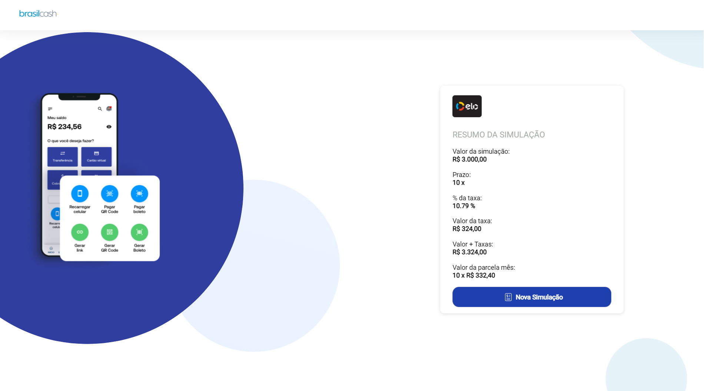
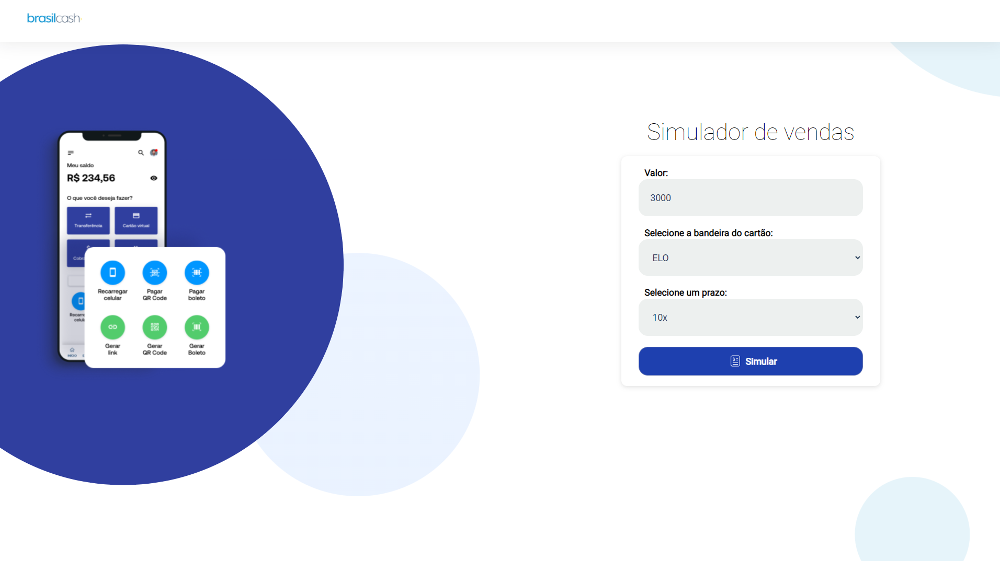

  

Título: challenges Frontend - Brasil Cash

Descrição: Simulador de vendas

Ferramentas, dependências e libs instaladas: **ReactJs**, **Axios**, **Typescript**, **Styled-Components**.

---

  

  
   

Deploy:

Para rodar o projeto localmente: Faça o clone do repositório, navegue ate a pasta destino, utilize o comando yarn install, rode o projeto com o comando yarn start.

  <small>Diogo Silva- 2022</small>

